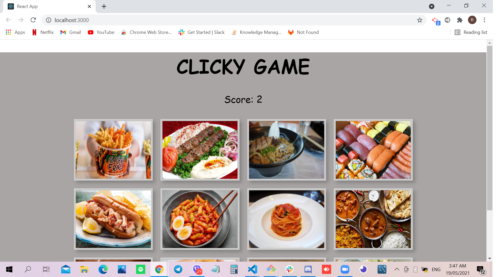

# Clicky Game

## Site Picture


## Technologies Used
- Javascript - adds special effects on pages
- Node.js - an open source server environment that uses JavaScript on the server
- React - a JavaScript library for building user interfaces
- GitBash - for cloning repository and pushing code to GitHub
- GitHub - holds repository that deploys to GitHub Pages

# Summary
This file contains code that allows the user to play the Clicky Game. It also contains code that was created using Javascript, React and Node.js. 

## Code Snippet
```javascript
useEffect(() => { shuffleImages(images) }, [selected])
    return (
      <div className="game">
        <h1>CLICKY GAME</h1> 
        <p>Score: {score}</p>
        <div className="images">
        {
            images.map((image, index) => 
                <div className="image" key={index} onClick={() => handleChanges(image)}>
                    <div className="img">
                        
                    </div>
                </div>
            )
        }
        </div>
      </div>
    );
  }
  ```

```javascript
<javascript>

</javascript>
```

## Author Links 
[LinkedIn](https://www.linkedin.com/in/rosario-miranda-b81170132/)<br />
[GitHub](https://github.com/rtmiranda18)
